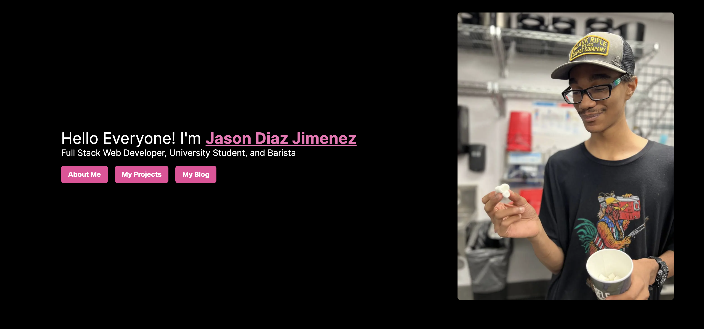

# Ozzy Website


## Information about the website
This is the **5th** Major version of my personal website. In this version I said, fuck it. We'll be simple and less complicated. I started using tailwind. For projects and blogs it'll be under sanity.io an awesome CMS I recommend. Each section is their own page rather than all in the home page. Took away the furry parts of my personal website (might put it back, we'll see).

## What's new in this major version
- 🧾 Sentry for Projects and Blogs
- 🎨 New Design
- ❌ Less Furry (experiement??)
- 🪡 Tailwind is added

## How to run this?

```bash
# Clone the repository
git clone https://github.com/VulpoTheDev/Website
# Install the Bloat Stuff I mean Depenedcies
yarn install
# Run that baby UwU
yarn dev
```

## Tech Stack
- Next.js 
- Typescript
- Tailwind
- 