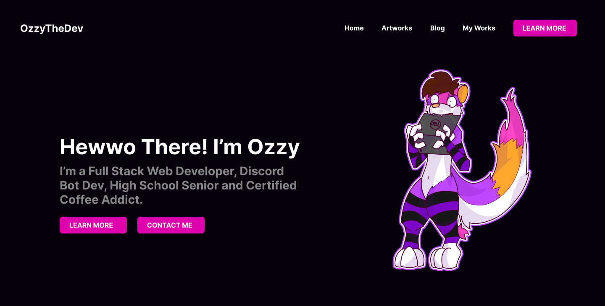

# Ozzy Website


## Information about the website
This is the **Third** Major version of my personal website. In this website there will be a brand new design that's better than v2 and v1 with thanks to the tips and advices from my good friend [Jaker](https://github.com/jakewazhere) for designing

## What's new in this major version
- 🧾 Blog (FINALLY)
- 🎨 New Design
- 🖼️ Place for all my Artworks
- ✨ Appreciation to those who helped me
- 🤵 More Fancy Stuff
- 😍 Oh Yeah I Finally Changed the Readme

## How to run this?

```bash
# Clone the repository
git clone https://github.com/VulpoTheDev/Website
# Install the Bloat Stuff I mean Depenedcies
yarn install
# Run that baby UwU
yarn dev
```

## Tech Stack
- Next.js 
- Typescript
- SCSS